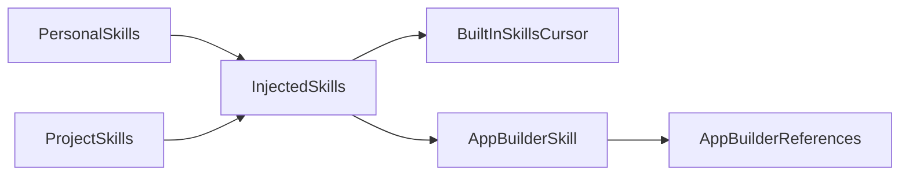

# Skills and references (local inventory)

This document summarizes which agent skills exist on this machine, which ones are currently injected into the agent prompt, and where the large `app-builder` reference library lives.

## Injected skills (the agent is told to read/follow these when relevant)

| Skill | Path |
| --- | --- |
| app-builder | [/Users/tech/.claude/skills/app-builder/SKILL.md](/Users/tech/.claude/skills/app-builder/SKILL.md) |
| babysit | [/Users/tech/.cursor/skills-cursor/babysit/SKILL.md](/Users/tech/.cursor/skills-cursor/babysit/SKILL.md) |
| canvas | [/Users/tech/.cursor/skills-cursor/canvas/SKILL.md](/Users/tech/.cursor/skills-cursor/canvas/SKILL.md) |
| create-hook | [/Users/tech/.cursor/skills-cursor/create-hook/SKILL.md](/Users/tech/.cursor/skills-cursor/create-hook/SKILL.md) |
| create-rule | [/Users/tech/.cursor/skills-cursor/create-rule/SKILL.md](/Users/tech/.cursor/skills-cursor/create-rule/SKILL.md) |
| create-skill | [/Users/tech/.cursor/skills-cursor/create-skill/SKILL.md](/Users/tech/.cursor/skills-cursor/create-skill/SKILL.md) |
| statusline | [/Users/tech/.cursor/skills-cursor/statusline/SKILL.md](/Users/tech/.cursor/skills-cursor/statusline/SKILL.md) |
| update-cli-config | [/Users/tech/.cursor/skills-cursor/update-cli-config/SKILL.md](/Users/tech/.cursor/skills-cursor/update-cli-config/SKILL.md) |
| update-cursor-settings | [/Users/tech/.cursor/skills-cursor/update-cursor-settings/SKILL.md](/Users/tech/.cursor/skills-cursor/update-cursor-settings/SKILL.md) |

## Built-in Cursor skills (available to open, not necessarily injected)

All built-in skills live under:

- [/Users/tech/.cursor/skills-cursor/](/Users/tech/.cursor/skills-cursor/)

In this environment, that folder includes (non-exhaustive, per discovery):

- [/Users/tech/.cursor/skills-cursor/create-subagent/SKILL.md](/Users/tech/.cursor/skills-cursor/create-subagent/SKILL.md)
- [/Users/tech/.cursor/skills-cursor/cursor-blame/SKILL.md](/Users/tech/.cursor/skills-cursor/cursor-blame/SKILL.md)
- [/Users/tech/.cursor/skills-cursor/migrate-to-skills/SKILL.md](/Users/tech/.cursor/skills-cursor/migrate-to-skills/SKILL.md)
- [/Users/tech/.cursor/skills-cursor/shell/SKILL.md](/Users/tech/.cursor/skills-cursor/shell/SKILL.md)

## Where to put your own skills

Per the built-in `create-skill` guidance:

- Personal skills: `~/.cursor/skills/<skill-name>/SKILL.md` (all projects)
- Project skills: `.cursor/skills/<skill-name>/SKILL.md` (shared in a repo)
- Do not author new skills under `~/.cursor/skills-cursor/` (built-in system-managed)

Entry point:

- [/Users/tech/.cursor/skills-cursor/create-skill/SKILL.md](/Users/tech/.cursor/skills-cursor/create-skill/SKILL.md)

## app-builder references (main entry points)

The `app-builder` skill has a large reference library under its `references/` directory.

### Canonical reference tree

- [/Users/tech/.claude/skills/app-builder/references/](/Users/tech/.claude/skills/app-builder/references/)

Start here:

- [/Users/tech/.claude/skills/app-builder/references/REFERENCE_INDEX.md](/Users/tech/.claude/skills/app-builder/references/REFERENCE_INDEX.md)

Always-load security guide (as called out by the index):

- [/Users/tech/.claude/skills/app-builder/references/security/security_guide.md](/Users/tech/.claude/skills/app-builder/references/security/security_guide.md)

### Project-local copy (this workspace)

This workspace also contains a project-local copy of the `app-builder` reference tree under `.cursor/skills/`:

- [/Users/tech/dcaars/.cursor/skills/app-builder/references/](/Users/tech/dcaars/.cursor/skills/app-builder/references/)

If you ever add a project skill under:

- [/Users/tech/dcaars/.cursor/skills/](/Users/tech/dcaars/.cursor/skills/)

…that is where it would live for this workspace.

## Mental model

